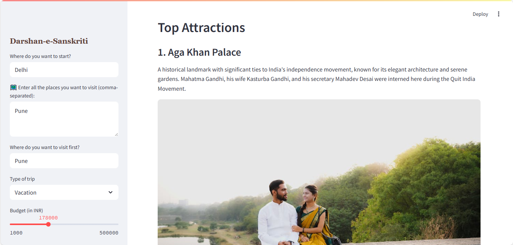

# Darshan-e-Sanskriti

### ✈️ AI-Powered Travel Planner

An intelligent, all-in-one **travel planning assistant** built with **Streamlit**, **LLMs**, and **data agents**. Just input your preferences (origin, places, budget, etc.), and it will generate:

- 🌍 An interactive travel map  
- 🏰 Attraction recommendations with images  
- 🌦️ Weather forecasts  
- ✈️ Flights information  
- 📋 A summarized travel guide  

---

## 🚀 Features

### 1. User Input Panel (Sidebar Form)

Users start their journey by entering:

- **Origin**: Where the trip begins  
- **Destinations**: Comma-separated list of places to visit  
- **First Destination**: The place the trip starts with  
- **Trip Type**: Vacation / Business / Adventure / Cultural *(default is Vacation)*  
- **Budget**: Range slider (₹1,000 to ₹5,00,000)  
- **Travel Dates**: Select one or more dates  

✅ **Validation** ensures required fields are filled. Missing info shows real-time warnings.

---

### 2. Interactive Map Display 🗺️

After clicking **"Show Trip Map"**, it displays a **route map** from the origin to all specified destinations using:

- **Folium** for map rendering  
- **Polylines** to draw the path between waypoints  
- **Map tiles** (e.g., OpenStreetMap)

---

### 3. Top Attractions 🏰

For the **first destination**:

- An **LLM-powered agent** (`TravelAgent`) fetches top attractions using tools like `WikiSearchAgent`, `SerperSearch`, and Google Image APIs.
- Each attraction includes:
  - Name  
  - Description  
  - Image *(validated for accessibility; falls back to Google Images)*

Images are displayed using `st.image()` with `use_container_width=True`.

---

### 4. Weather Forecast 🌦️

For selected **travel dates** and **destination**:

- Calls the **weather research agent**
- Parses model responses using robust **regex-based JSON extractors**

Displays:
- 📊 A **bar chart** of daily high/low temps using **Altair**  
- 🧾 A **table** of weather summary  
- 📝 Daily weather summaries with icons  
- 💡 Custom travel recommendations based on forecast

---

### 5. Flight Search ✈️

Finds flights from **origin** to the selected **destination** within the given **budget** and **travel dates**:

- Uses `TravelAgent.search_flights()`
- Parses flight info with fallback to `ast.literal_eval()` if JSON fails

Displays:
- 📋 Table of flights *(airline, departure, arrival, duration, price)*  
- 📊 **Bar chart**: Airline vs Price *(with color indicating budget compliance)*

---

### 6. Smart Summary 📋

Finally, it generates a **customized summary** of the entire trip using an LLM agent:

- Covers destination, trip type, budget, and travel dates  
- Uses `agent.summarize_trip()` with contextual inputs  
- Displays a **short paragraph** to help the user visualize the whole experience

---


## 🌐 Live Demo

👉 [Launch Live App](https://darshan-e-sanskriti-rdehpyno22fhefwaddtv9z.streamlit.app/)

---

## 📸 Screenshots

<div align="center">

  
<br/><br/>

| Image 1 | Image 2 | Image 3 | Image 4 |
|--------|--------|--------|--------|
|  |  |  |  |

| Image 5 | Image 6 | Image 7 | Image 8 |
|--------|--------|--------|--------|
|  |  |  |  |

| Image 9 | Image 10 | Image 11 | Image 12 |
|--------|---------|----------|----------|
|  |  |  |  |

| Image 13 | Image 14 | Image 15 | Image 16 |
|---------|---------|----------|----------|
|  |  |  |  |

</div>

---


## ⚙️ Local Setup Instructions

1. **Clone the repository**

   ```bash
   git clone https://github.com/Satyam-Mishra-1/darshan-e-sanskriti.git
   cd darshan-e-sanskriti
   ```

2. **Create and activate a Python virtual environment**

   ```bash
   python -m venv myenv
   # Windows:
   myenv\Scripts\activate
   
   # macOS/Linux:
   source myenv/bin/activate
   ```

3. **Install dependencies**

   ```bash
   pip install -r requirements.txt
   ```
   
## 📦 `requirements.txt`

```txt
taskflowai
python-dotenv
streamlit
ipykernel
from_root
google-generativeai
```

**Note:**  
Remove `-e .` unless you have a `setup.py` or `pyproject.toml`.

4. **Create a `.env` file in the root directory**

   Add your environment variables here:
   
---

## 🔐 Required Environment Variables

| Variable Name          | Description                                      |
|------------------------|--------------------------------------------------|
| `WEATHER_API_KEY`      | API key for accessing weather data               |
| `SERPER_API_KEY`       | API key for Serper (search engine)               |
| `AMADEUS_API_KEY`      | API key for Amadeus travel API                   |
| `AMADEUS_API_SECRET`   | API secret for Amadeus travel API                |
| `GEMINI_API_KEY`       | API key for Google Gemini                        |
| `GOOGLE_API_KEY`       | API key for Google Gemini or generative AI       |
| `UNSPLASH_API_KEY`     | Unsplash API key                                 |
| `UNSPLASH_ACCESS_KEY`  | Unsplash access key                              |
| `UNSPLASH_SECRET_KEY`  | Unsplash secret key                              |
| `PEXELS_API_KEY`       | Pexels API key                                   |


---


6. **Run the app**

   ```bash
   streamlit run app.py
   ```

---

## ☁️ Deploying on Streamlit Cloud

1. Push your repo to GitHub.

2. In Streamlit Cloud, create a new app pointing to:

   - Your GitHub repo
   - Branch: `main`
   - Main file: `app.py`

3. Add environment variables in **Manage App → Settings → Secrets**:

---

## 🛠 Troubleshooting

- **ModuleNotFoundError:** Ensure all source files (e.g., `src/agentic/agents/travel_agent.py`) are included and import paths are valid.
- **Missing environment variables:** Ensure `.env` is present locally and variables are added to Streamlit Cloud Secrets.
- **Project error on deployment:** Remove `-e .` from `requirements.txt` unless packaging your app.

---

## 📜 License

Licensed under the [MIT License](LICENSE).

---

## 🙏 Acknowledgements

- [Streamlit](https://streamlit.io)
- [Google Gemini API](https://ai.google.dev/)
- [TaskflowAI](https://pypi.org/project/taskflowai/)
